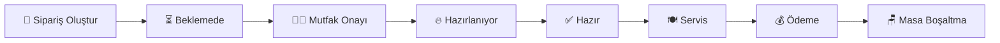

# SD Cafe - Restaurant Management System


**Modern restoran işletmeleri için geliştirilmiş kapsamlı otomasyon sistemi**

---

## 📋 Proje Hakkında

SD Cafe, restoran işletmelerinin tüm operasyonel süreçlerini dijitalleştiren modern bir yönetim sistemidir. Sipariş yönetiminden ödeme işlemlerine, mutfak operasyonlarından raporlamaya kadar restoran işletmeciliğinin her alanını kapsar.

### 🎯 Ana Hedefler
- **Operasyonel Verimlilik**: Sipariş süreçlerini hızlandırma
- **Müşteri Memnuniyeti**: Hızlı ve doğru servis
- **Finansal Kontrol**: Gelir takibi ve raporlama
- **Personel Yönetimi**: Role-based yetkilendirme sistemi

## 🏗️ Proje Mimarisi

Proje, **N-Tier (Katmanlı) Mimari** yaklaşımı kullanılarak geliştirilmiştir:

```
SD_Cafe/
├── 📁 SDCafe.Web/          # 🌐 MVC Web Uygulaması (Ana Panel)
├── 📁 SDCafe.API/          # 🔌 REST API Katmanı
├── 📁 SDCafe.Business/     # ⚙️ İş Mantığı Katmanı
├── 📁 SDCafe.DataAccess/   # 🗄️ Veri Erişim Katmanı
└── 📁 SDCafe.Entities/     # 📊 Veri Modelleri
```

### Katman Detayları

| Katman | Açıklama | Teknolojiler |
|--------|----------|--------------|
| **SDCafe.Web** | MVC web uygulaması (Ana yönetim paneli) | ASP.NET Core MVC, Bootstrap 5, Font Awesome |
| **SDCafe.API** | REST API endpoint'leri | ASP.NET Core Web API, JSON |
| **SDCafe.Business** | İş kuralları ve servisler | C# Services, Interfaces |
| **SDCafe.DataAccess** | Veri erişimi | Entity Framework Core, SQLite |
| **SDCafe.Entities** | Domain modelleri | C# Classes, Data Annotations |

## 🛠️ Teknoloji Stack'i

### Backend
- **.NET 9.0** - Ana framework
- **ASP.NET Core MVC** - Web uygulaması
- **ASP.NET Core Web API** - REST API
- **Entity Framework Core** - ORM
- **SQLite** - Veritabanı

### Frontend
- **Bootstrap 5.3** - CSS framework
- **Font Awesome 6.0** - Icon kütüphanesi
- **jQuery** - JavaScript kütüphanesi
- **Razor Views** - Template engine

### Güvenlik
- **Cookie Authentication** - Kimlik doğrulama
- **Role-based Authorization** - Yetkilendirme
- **Password Hashing** - Şifre güvenliği

## 👥 Kullanıcı Rolleri

### 🔑 Admin (Yönetici)
**Tam sistem yetkilerine sahip**
- ✅ Kullanıcı yönetimi 
- ✅ Sistem konfigürasyonu
- ✅ Tüm raporlara erişim
- ✅ Ürün, kategori, masa yönetimi
- ✅ Tüm modüllere erişim

### 👔 Manager (İşletmeci)
**Operasyonel yönetim yetkileri**
- ✅ Ürün ve kategori yönetimi
- ✅ Sipariş yönetimi
- ✅ Raporlar ve analizler
- ✅ Masa yönetimi

### 🍽️ Waiter (Garson)
**Sipariş ve servis operasyonları**
- ✅ Sipariş oluşturma
- ✅ Sipariş takibi
- ✅ Sipariş teslimi

### 👨‍🍳 Kitchen (Mutfak)
**Mutfak operasyonları**
- ✅ Sipariş görüntüleme
- ✅ Sipariş durumu güncelleme

### 💰 Cashier (Kasiyer)
**Ödeme işlemleri**
- ✅ Ödeme alma
- ✅ Fiş kesme

### 📊 Accounting (Muhasebe)
**Finansal raporlama**
- ✅ Günlük satış raporları
- ✅ Gelir analizi
- ✅ Finansal dashboard

## 🔄 Sipariş Yaşam Döngüsü



### 1. 📝 Sipariş Oluşturma
**Sorumlu**: Garson (Waiter)
- Müşteri masaya oturur
- Garson boş masayı işgal eder
- Menüden ürünler seçilir
- Sipariş sisteme kaydedilir
- **Durum**: `Pending` (Beklemede)

### 2. 👨‍🍳 Mutfak Onayı
**Sorumlu**: Mutfak Personeli (Kitchen)
- Bekleyen siparişler mutfak panelinde görüntülenir
- Mutfak personeli siparişi kabul eder
- **Durum**: `Preparing` (Hazırlanıyor)

### 3. 🔥 Hazırlama Süreci
**Sorumlu**: Mutfak Personeli (Kitchen)
- Sipariş hazırlanır
- Hazırlama tamamlandığında durum güncellenir
- **Durum**: `Ready` (Hazır)

### 4. 🍽️ Servis
**Sorumlu**: Garson (Waiter)
- Hazır siparişler garson panelinde görüntülenir
- Garson siparişi müşteriye teslim eder
- **Durum**: `Completed` (Tamamlandı)

### 5. 💰 Ödeme
**Sorumlu**: Kasiyer (Cashier)
- Tamamlanan siparişler için ödeme alınır
- Ödeme yöntemi seçilir (Nakit, Kart, Mobil)
- Fiş kesilir
- **Durum**: Ödeme `Completed`

### 6. 🪑 Masa Boşaltma
**Otomatik**: Sistem
- Ödeme tamamlandıktan sonra masa otomatik boşaltılır
- Masa yeni müşteriler için hazır hale gelir


## 🚀 Kurulum

### 📋 Gereksinimler
- **.NET 9.0 SDK** veya üzeri
- **Visual Studio 2022** veya **VS Code**
- **SQLite** (otomatik kurulum)

### 🔧 Adım Adım Kurulum

#### 1. Projeyi Klonlayın
```bash
git clone https://github.com/your-repo/SD_Cafe.git
cd SD_Cafe
```

#### 2. Bağımlılıkları Yükleyin
```bash
dotnet restore
```

#### 3. Veritabanını Oluşturun
```bash
# Migration oluştur
dotnet ef migrations add InitialCreate --project SDCafe.DataAccess --startup-project SDCafe.Web

# Veritabanını güncelle
dotnet ef database update --project SDCafe.DataAccess --startup-project SDCafe.Web
```

#### 4. Web Uygulamasını Çalıştırın
```bash
dotnet run --project SDCafe.Web
```

#### 5. API'yi Çalıştırın (Opsiyonel)
```bash
dotnet run --project SDCafe.API
```

### 🌐 Erişim Bilgileri
- **Web Uygulaması**: https://localhost:7001
- **API**: https://localhost:7002
- **Swagger**: https://localhost:7002/swagger

## 🔐 Varsayılan Kullanıcılar

Sistem ilk çalıştırıldığında aşağıdaki test kullanıcıları otomatik oluşturulur:

| 👤 Kullanıcı | 📧 E-posta | 🔑 Şifre | 🎭 Rol | 
| **Admin** | admin@sdcafe.com | admin123 | Admin | 
| **Manager** | manager@sdcafe.com | admin123 | Manager | 
| **Waiter** | waiter@sdcafe.com | admin123 | Waiter | 
| **Kitchen** | kitchen@sdcafe.com | admin123 | Kitchen | 
| **Cashier** | cashier@sdcafe.com | admin123 | Cashier | 
| **Accounting** | accounting@sdcafe.com | admin123 | Accounting | 

## 🌐 API Endpoints

### 📋 Siparişler
| Method | Endpoint | Açıklama |
| `GET` | `/api/orders` | Tüm siparişleri listele |
| `GET` | `/api/orders/{id}` | Sipariş detaylarını getir |
| `POST` | `/api/orders` | Yeni sipariş oluştur |
| `PUT` | `/api/orders/{id}` | Sipariş güncelle |
| `DELETE` | `/api/orders/{id}` | Sipariş sil |

### 📦 Ürünler
| Method | Endpoint | Açıklama |
| `GET` | `/api/products` | Tüm ürünleri listele |
| `GET` | `/api/products/{id}` | Ürün detaylarını getir |
| `GET` | `/api/products/categories` | Kategorileri listele |
| `POST` | `/api/products` | Yeni ürün oluştur |
| `PUT` | `/api/products/{id}` | Ürün güncelle |
| `DELETE` | `/api/products/{id}` | Ürün sil |

### 💳 Ödemeler
| Method | Endpoint | Açıklama |
| `GET` | `/api/payments` | Tüm ödemeleri listele |
| `GET` | `/api/payments/{id}` | Ödeme detaylarını getir |
| `POST` | `/api/payments` | Yeni ödeme oluştur |

### 👥 Kullanıcılar
| Method | Endpoint | Açıklama |
| `GET` | `/api/users` | Tüm kullanıcıları listele |
| `GET` | `/api/users/{id}` | Kullanıcı detaylarını getir |
| `POST` | `/api/users` | Yeni kullanıcı oluştur |
| `PUT` | `/api/users/{id}` | Kullanıcı güncelle |
| `DELETE` | `/api/users/{id}` | Kullanıcı sil |


## 🐛 Sorun Giderme

### 🗄️ Veritabanı Bağlantı Sorunu
```bash
# Veritabanını tamamen yeniden oluştur
dotnet ef database drop --force --project SDCafe.DataAccess --startup-project SDCafe.Web
dotnet ef database update --project SDCafe.DataAccess --startup-project SDCafe.Web
```

### 📦 Migration Sorunları
```bash
# Tüm migration'ları sil ve yeniden oluştur
dotnet ef migrations remove --project SDCafe.DataAccess --startup-project SDCafe.Web
dotnet ef migrations add InitialCreate --project SDCafe.DataAccess --startup-project SDCafe.Web
dotnet ef database update --project SDCafe.DataAccess --startup-project SDCafe.Web
```

### 🔐 Authentication Sorunu
- Browser'da çerezleri temizleyin
- Uygulamayı yeniden başlatın
- Cache'i temizleyin: `dotnet clean`

## 📈 Performans Optimizasyonları

- ✅ Async/await pattern'leri
- ✅ Entity Framework Include optimizasyonları
- ✅ Null safety controls
- ✅ Clean code practices
- ✅ Repository pattern implementation
- ✅ Lazy loading optimizasyonları

## 🧪 Test Kullanıcıları

Geliştirme ve test için hazır kullanıcılar:

```
🔑 Admin Test: admin@sdcafe.com / admin123
👔 Manager Test: manager@sdcafe.com / admin123  
🍽️ Waiter Test: waiter@sdcafe.com / admin123
👨‍🍳 Kitchen Test: kitchen@sdcafe.com / admin123
💰 Cashier Test: cashier@sdcafe.com / admin123
📊 Accounting Test: accounting@sdcafe.com / admin123
```

## 🤝 Katkıda Bulunma

1. 🍴 Fork yapın
2. 🌿 Feature branch oluşturun (`git checkout -b feature/amazing-feature`)
3. 💾 Değişikliklerinizi commit edin (`git commit -m 'Add amazing feature'`)
4. 📤 Branch'inizi push edin (`git push origin feature/amazing-feature`)
5. 🔄 Pull Request oluşturun

